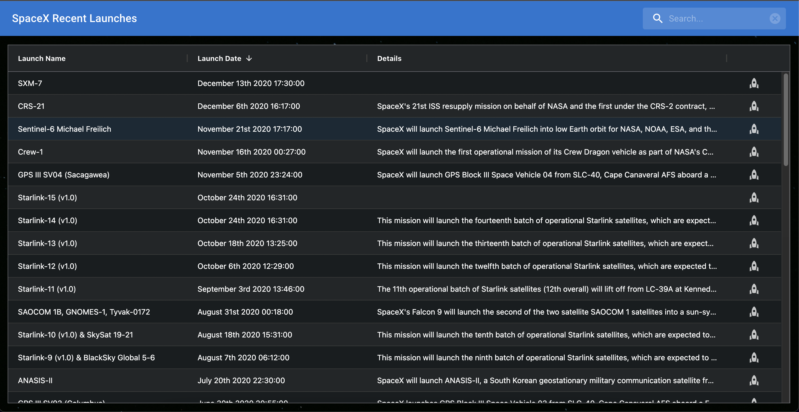
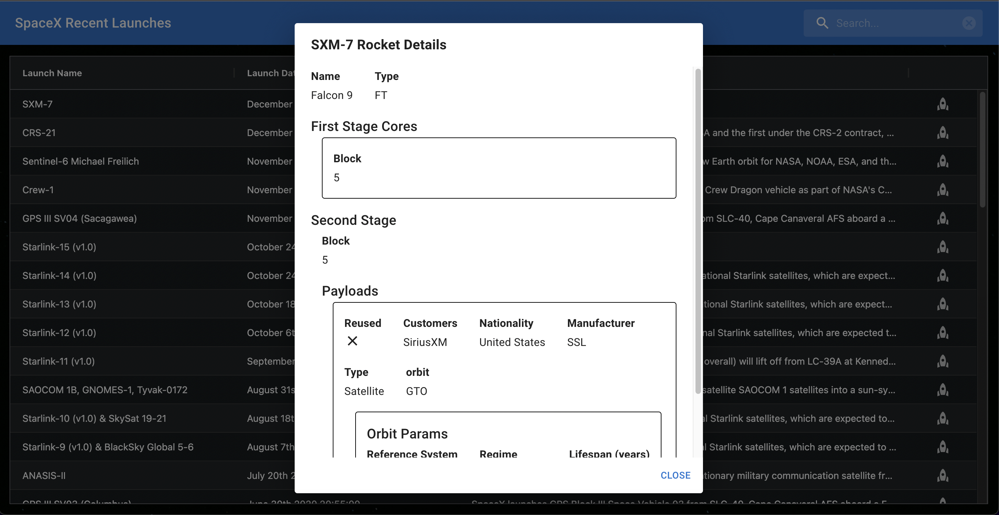
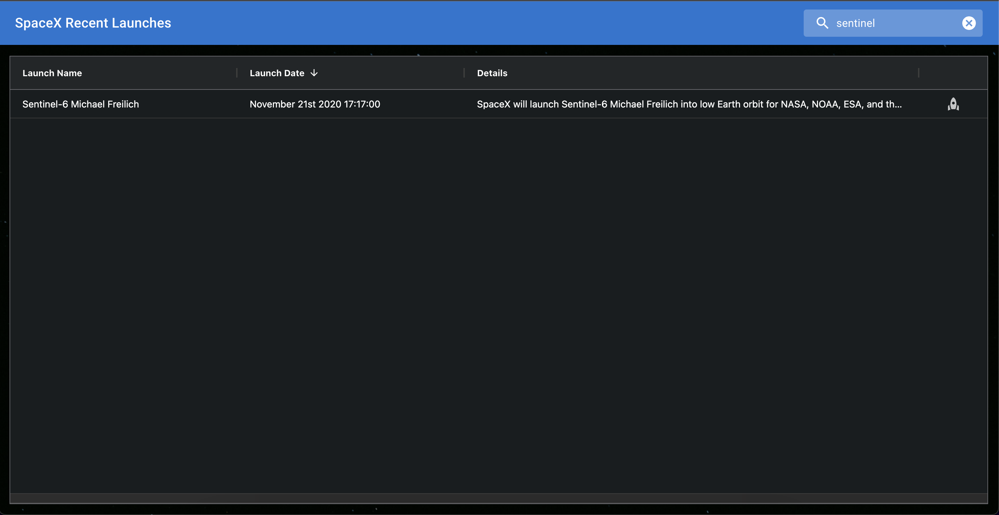

## SpaceX Recent Launches

An application to allow users to view the most recent 50 SpaceX launches.

The user can click the rocket icon to view the rocket details for that launch. They can also use the search input to filter the launches by launch name.

## Project Screen Shot(s)

## Installation and Setup Instructions

Firstly, clone this repository. You will need `node` and `npm` installed globally on your machine.

Installation:

`npm install`

To Run Test Suite:

`npm test`

To Start Server:

`npm start`

To Visit App:

`localhost:3000/`

## Reflection

This application was built with `create-react-app`.

The frontend is split between UI and an API layer. The API layer manages any interactions with the backend and allows us to decouple our network requests and their responses from our UI components. Currently the API layer pulls down all 50 launches and then all the functionality is handled client side (such as filtering, sorting and displaying rocket details).

The UI layer contains all our components. Majority of the components used are from the `Material UI` library including all icons but there are also some custom components that have been styled using `emotion`.

Automated test coverage has been provided using `jest` with `testing-library`.
